 

# ETL

## 1. Row (จัดการแถว)

 การจัดแถว [ที่1] ทิ้ง 

1. **Remove Rows** > **Remove top Rows**     
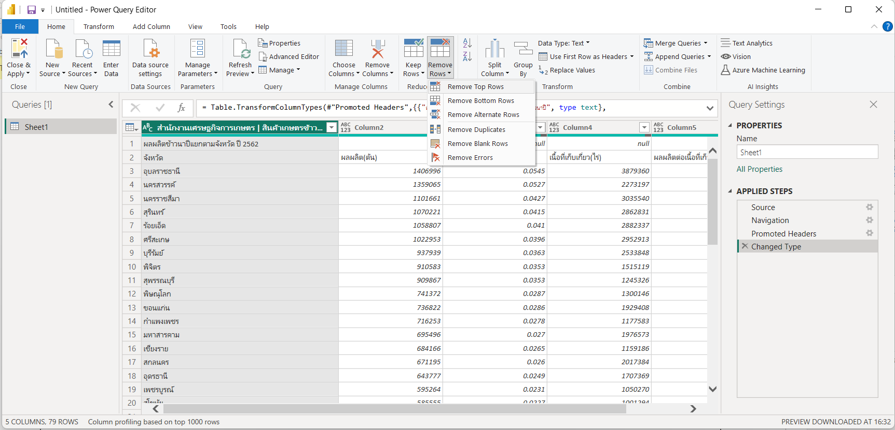  
2. **Number of rows** > 1 แถว > **OK**       
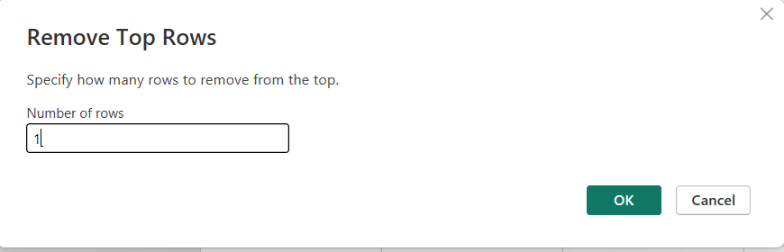

 

## 2. Columns (จัดการคอลัมน์)

 2.1 สร้างหัวคอลัมน์ (Header) 

1. เลือกแถว
2. แท็บ Home > **Use First Row as Headers**   
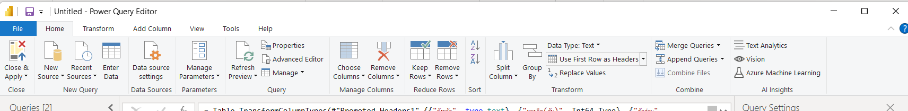

 2.2 เพิ่มคอลัมน์ (add field) 

 Add field 

1. แท็บ **Add Column** > **Custom Column**
2. ตั้งชื่อ **field New column name** > **Custom column formula**  
ในที่นี้ จะเพิ่มคอลัมน์ชื่อ “ประเภท” ⇒ ข้อมูลคือ “ข้าว”  
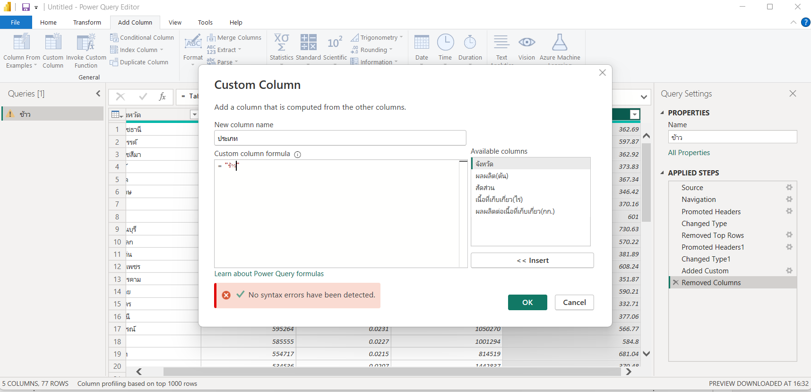

 Add field with conditions 

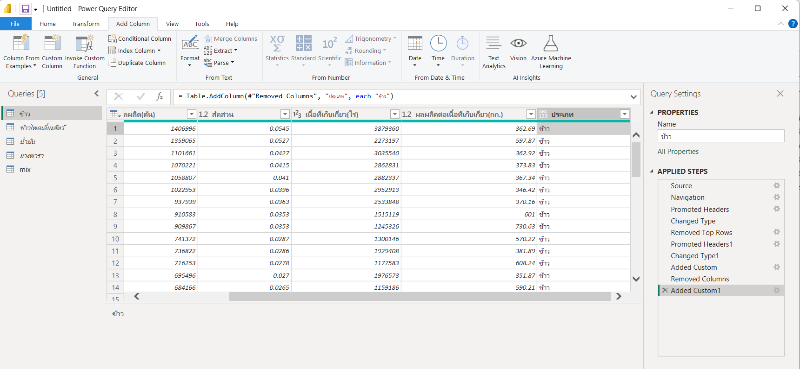  

ไปที่แท็บ Add column > Conditional Column  
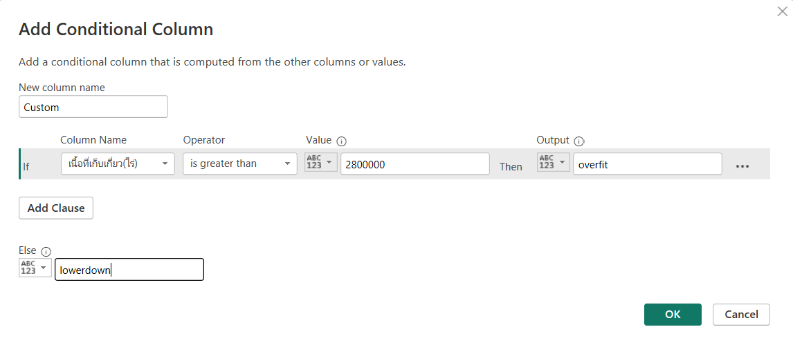

 2.3 การจัดกลุ่มข้อมูล เพิ่มคอลัมน์ 

- Arrange Group  
    1. เลือก Age  
    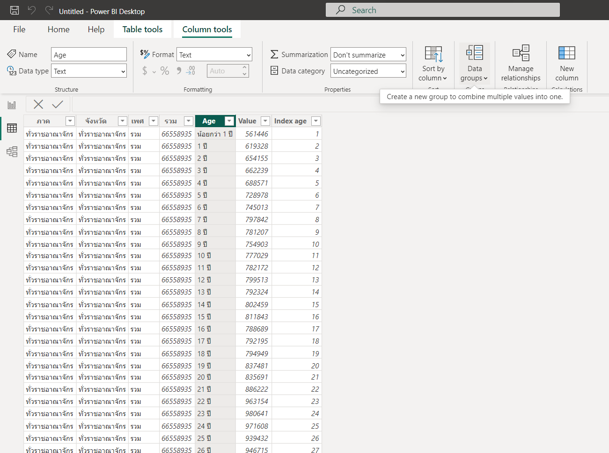  
    2. คลิกตรง **Data group** > **New data groups**
    3. ใส่ชื่อเป็น **Age_Group**
    4. ให้เลือก 60 ปี แล้วกดปุ่ม **shift** ค้างไว้ เลื่อนลงมาจนถึง 101 ปี หรือมากกว่า
    5. คลิกปุ่ม **Group**
    6. อีกกลุ่มทำเช่นเดิม  
    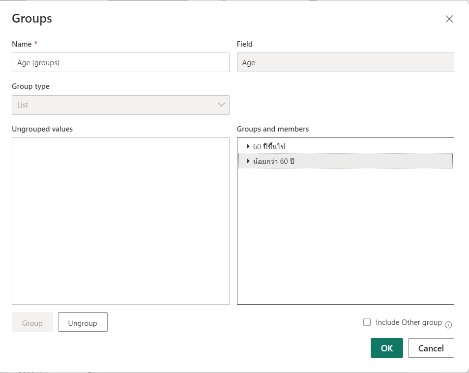  
    ได้ผลลัพธ์ดังนี้  
    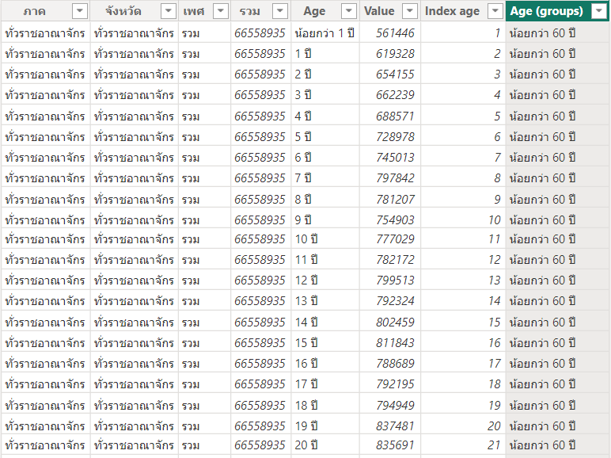  

 2.4 การแบ่งข้อมูล (Split Columns) 

> - Split Column By Delimiter ⇒ใช้แบ่งคอลัมน์โดยระบุอักขระคั่น
> - Split Column By Position ⇒ ใช้แบ่งคอลัมน์โดยใช้การนับตำแหน่ง
> - Split Column By Non-Digit to Digit ⇒ ใช้แบ่งคอลัมน์จากข้อมูลที่ไม่ใช่ตัวเลขไปยังที่เป็นตัวเลข
> - Split column By Digit to Non-Digit ⇒ ใช้แบ่งคอลัมน์จากข้อมูลที่เป็นตัวเลขไปยังที่ไม่ใช่ตัวเลข
> - Split column By Number of Character ⇒ ใช้แบ่งคอลัมน์โดยการนับจำนวนตัวอักษร
> - Split column By Lowercase to Uppercase ⇒ ใช้แบ่งคอลัมน์จากตัวพิมพ์เล็กไปยังตัวพิมใหญ่
> - Split column By Uppercase to Lowercase ⇒ ใช้แบ่งคอลัมน์จากตัวพิมพ์ใหญ่ไปยังตัวพิมเล็ก

<!-- ตัวอย่าง: 1. Split Column By Delimiter -->

 1. Split Column By Delimiter (ใช้แบ่งคอลัมน์โดยระบุอักขระคั่น) 

- เลือก Type-Order โดยการคลิกคอลัมน์
- จากแท็บ **Home** > คลิก Dropdown > เลือก **Split Column > By Delimiter**  
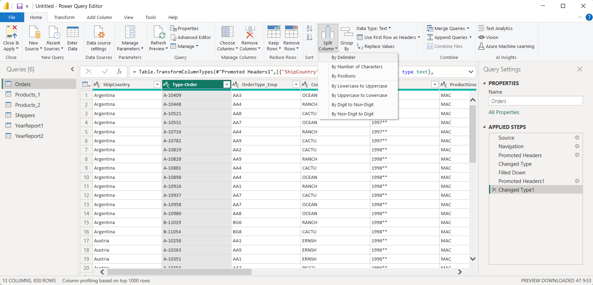  
- ในตัวอย่าง จะแบ่งข้อมูลต่าง เครื่องหมายขีด `-`
    - เลือก  - - Custom - - (ระบุแบ่งข้อมูลเอง)
    - เลือกหรือ ป้อนตัวคั่นที่ใช้แยกคอลัมน์ ในตัวอย่างนี้ **Select or enter delimiter : -**
    - เลือกออปชัน Split at : Each occurrence of the delimiter > OK
        - Left-most delimiter ตัวคั่นด้านซ้ายสุด
        - Right-most delimiter ตัวคั่นด้านขวาสุด
        - Each occurrence of the delimiter ทุกที่ที่มีตัวคั่นปรากฎ  
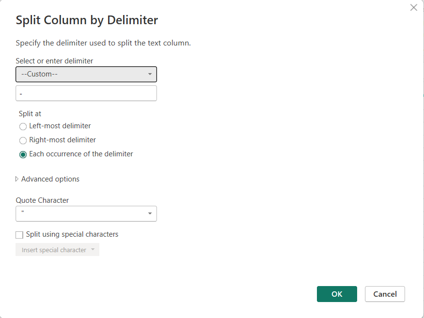  

- ผลลัพธ์ที่ได้คือ คอลัมน์ Type-Order จะถูกแบ่งออกเป็น 2 คอมลัมน์  
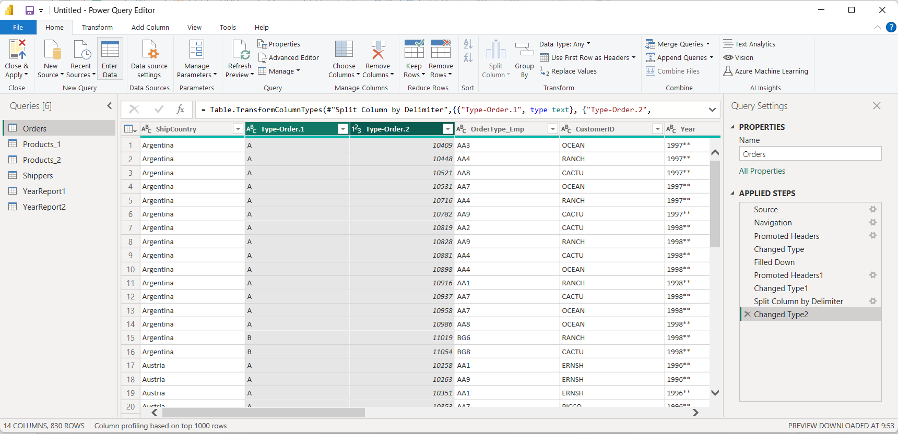  

> หมายเหตุ :  
> หากเลือก Advanced options ⇒ Rows  
> จะ แบ่งข้อมูลเป็นแถว   

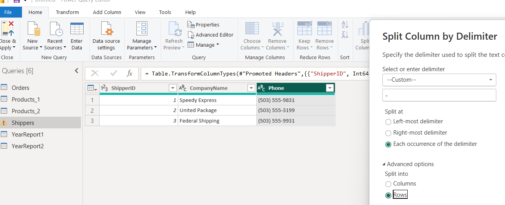  
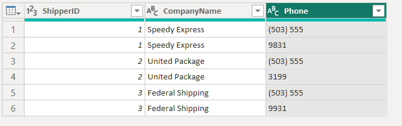  

 2. Split Column By Position (ใช้แบ่งคอลัมน์โดยใช้การนับตำแหน่ง) 

- คลิกที่คอลัมน์ **Year**
- แท็บ **Home > Split Column > By Position**
- ให้ใส่ตำแหน่งที่ต้องการจะแยก String ในคอลัมน์ **Position : 0, 4** ให้อัตโนมัติ > **OK**
    - ตำแหน่ง 0 คือ จุดเริ่มต้นของสตริง
    - คั่นด้วยคอมมา
    - ตำแหน่ง 4 คือ จุดสิ้นสุดของสตริงในคอลัมน์แรก  
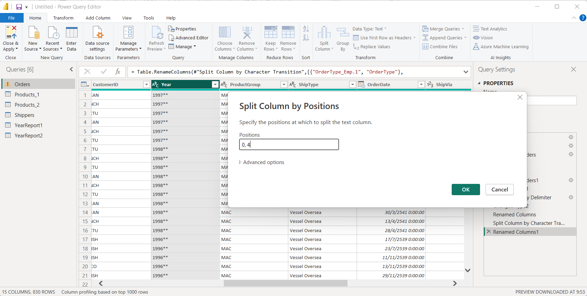  

- จะสร้างสตริงตำแหน่ง 0 ถึงตำแหน่ง 4 เป็นคอลัมน์แรก คือ Year.1 แล้วสตริงที่เหลือจะเป็นคอลัมน์ที่สองคือ Year.2  
ผลลัพธ์  
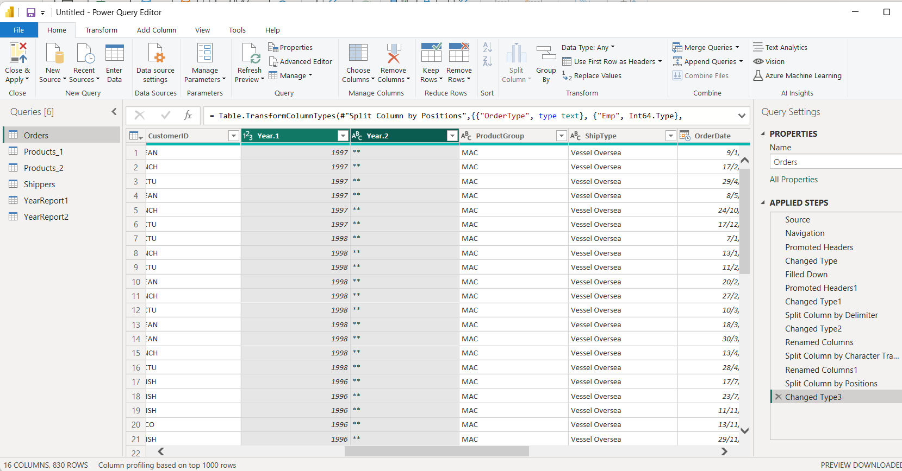

 3. Non-Digit to Digit (ใช้แบ่งคอลัมน์จากข้อมูลที่ไม่ใช่ตัวเลขไปยังที่เป็นตัวเลข) 

- คลิกที่คอลัมน์ **OrderType_Emp**
- แท็บ **Home > Split Column > By Non-Digit to Digit**  
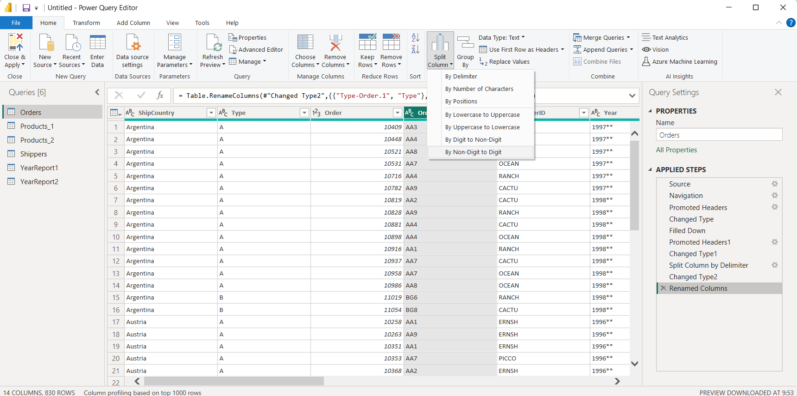  

- ในทำนองเดียวกัน หากต้องการแบ่งข้อมูลออกเป็นหลายคอลัมน์ ให้ใช้ , คั่น > 0, 6, 14 (หมายถึง 0-6, 7-14, 15 เป็นต้นไป)  
ผลลัพธ์  
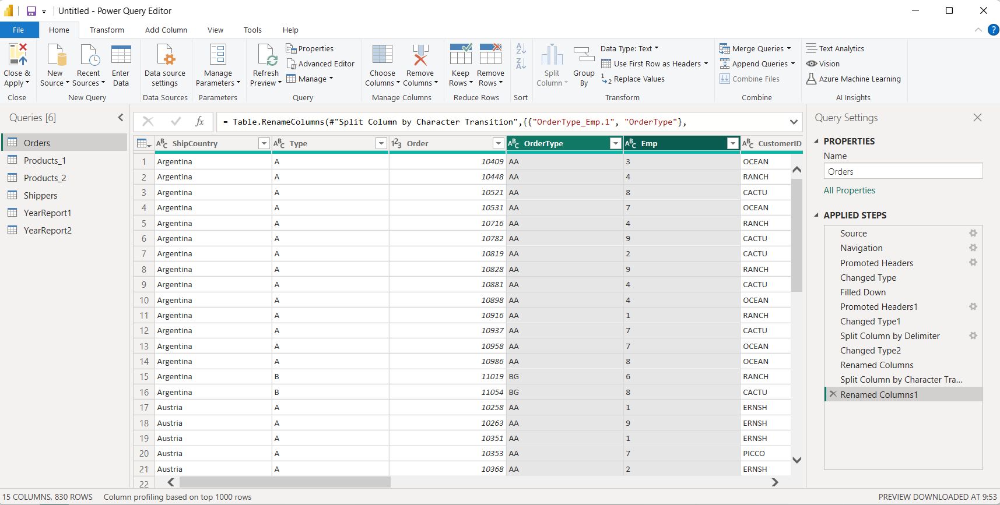

 2.5 Merge Columns 

- คลิกคอลัมน์ **OrderType_Emp.1** > กดปุ่ม **Ctrl** ค้างไว้ > คลิกคอลัมน์ **OrderType_Emp.2**
- แท็บ **Transform > Merge Column**
- กำหนดค่าในไดอะล็อกดังนี้
    - **Separator : Custom** (ต้องการกำหนดตัวคั่นระหว่างคอลัมน์เอง)
    - **Separator : -** (ใส่ตัวคั่นระหว่างข้อมูลของแต่ละคอลัมน์
    - **New column name (optional) : OrderType_Emp_Merge** (ตั้งชื่อคอลัมน์ใหม่)
        - None : รวมข้อมูลโดยไม่มีตัวคั่น เช่น AA3
        - Colon : รวมข้อมูลโดยคั่นด้วย “  : “  เช่น AA : 3
        - Comma : รวมข้อมูลโดย “ , ” เช่น AA, 3
        - Equal sign : รวมข้อมูลโดย “ = “ เช่น AA=3
        - Semicolon : รวมข้อมูลโดย “ ; “ เช่น AA;3
        - Space : รวมข้อมูลโดย “ (ช่องว่าง) “ เช่น AA  3
        - Tap : รวมข้อมูลโดย ระยะ Tap เช่น AA 3 (คล้าย Space)
        - Custom : รวมข้อมูลโดย การกำหนดเอง  
    
    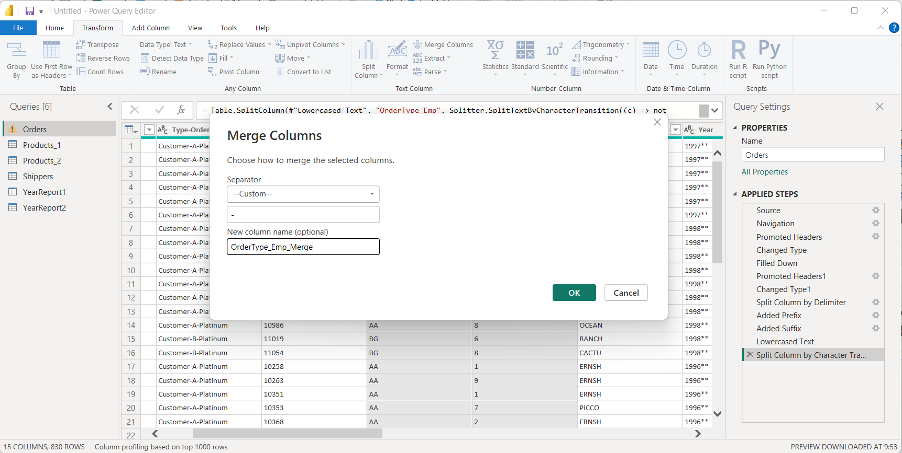  
    - ผลลัพธ์  
    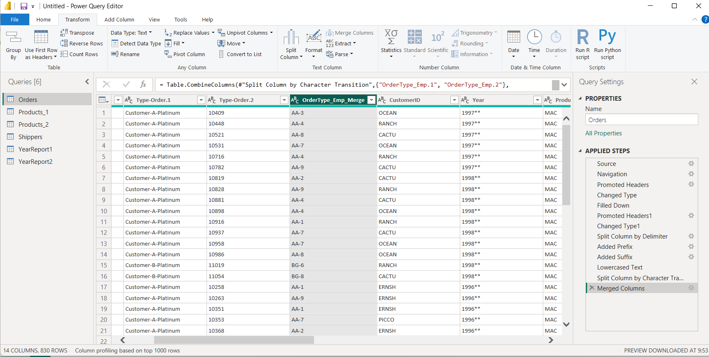  

 

## 3. การรวมตาราง

 3.1 การรวมหลายตาราง ด้วย append 

1. แท็บ **Home** > **Append Queries** > **Append Queries as New**
2. เลือก **Three or more tables**

append queries as New คือการสร้าง ตารางใหม่ขึ้นมา  
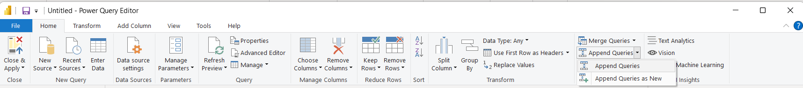  
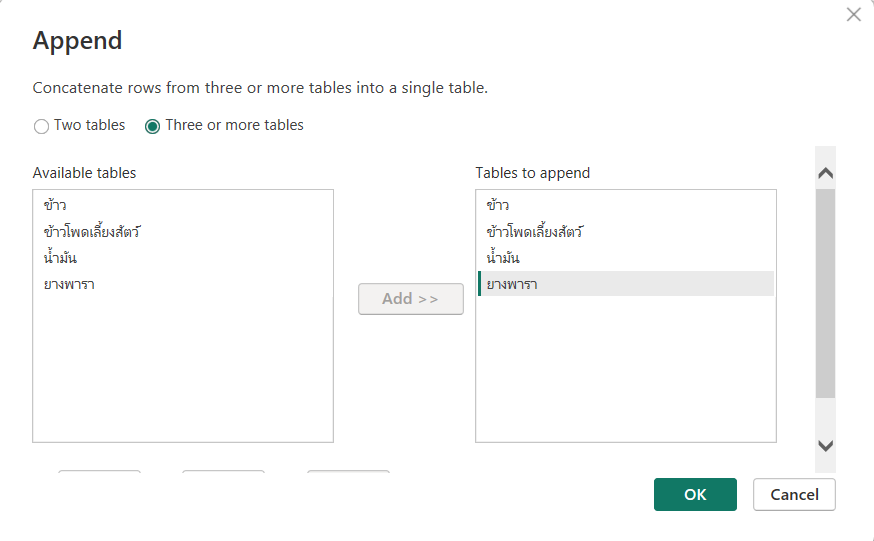

 3.2 การ Merge join ตาราง 

1. ไปที่แท็บ **Home > Merge Queries**  
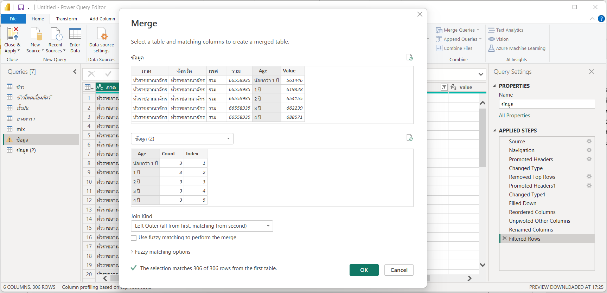  
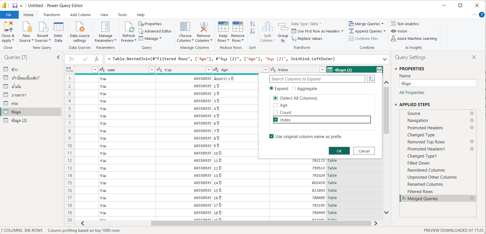

 

## 4. Transform data

 4.1 การเพิ่ม Prefix & Suffix 

- Add Prefix
    - เลือกคอลัมน์ **Type-Order.1**
    - แท็บ **Transform** > **Format** > **Add Prefix**
    - พิมพ์ค่า **Value : Customer-** > **OK**  
    
    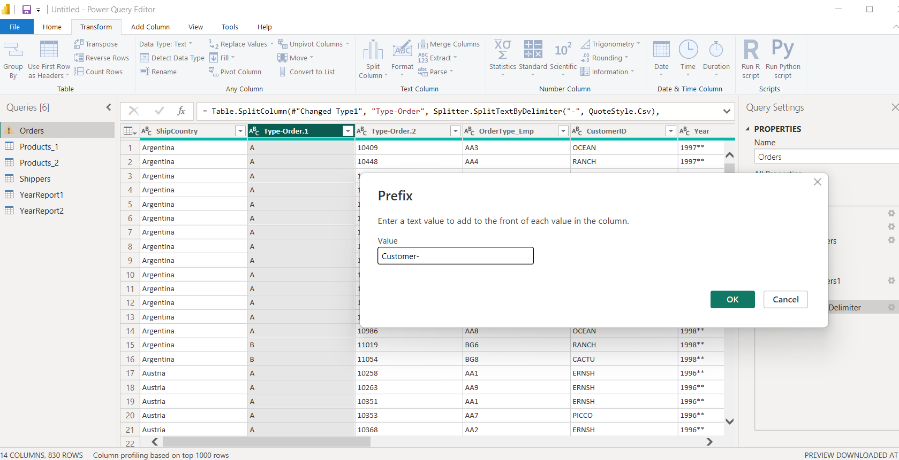

 4.2 การแปลง LOWERCASE , UPPERCASE , CAPITALIZE EACH WORD 

- Lowercase > แปลงข้อความทั้งหมดเป็นตัวพิมพ์เล็ก
- Uppercase > แปลงข้อความทั้งหมดเป็นตัวพิมพ์ใหญ่
- Capitalize Each Word > ใช้ตัวอักษรตัวพิมพ์ใหญ่ตัวแรกของแต่ละคำ

 4.2.1 ตัวอย่าง Lowercase 

- คลิกที่คอลัมน์ **ShipType**
- แท็บ **Transform > Format > lowercase**  

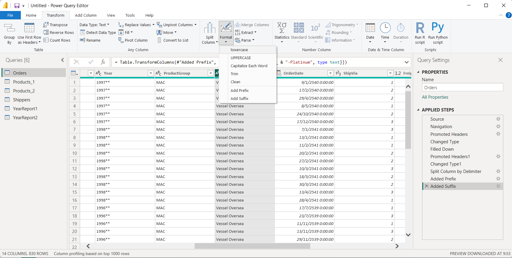

 

## 5. การเติมข้อมูล (FILL)

 5.1 เติมข้อมูลค่าว่างให้เติมด้วย Fill 

1. ไปที่แท็บ Transform > Fill > down  
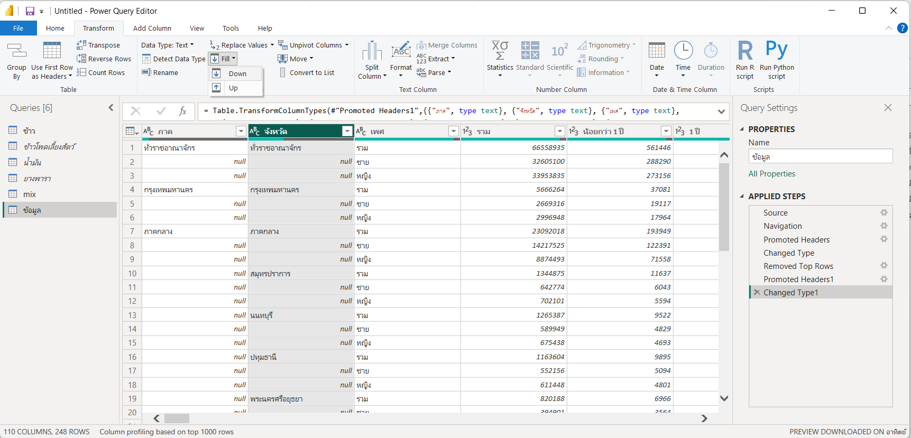

 

## 6. การสร้างตาราง Group By

 6.1 Table Group By 

> ไปที่แท็บ **Transform > Group by > Age > OK**

1. Count  
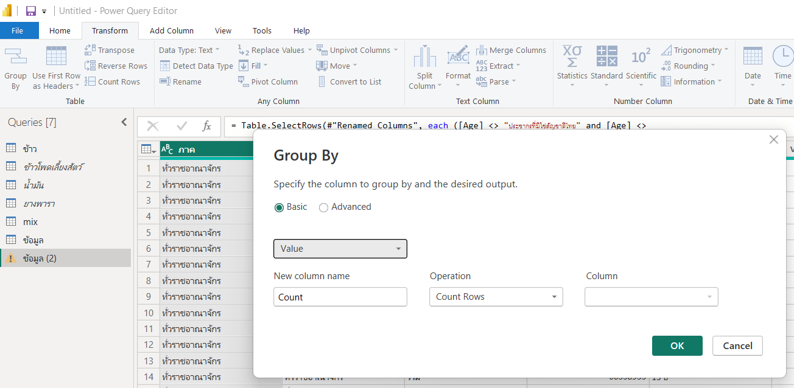  
2. Sum  
    - เลือกคอลัมน์ **Year.1**
    - กดแท็บ **Transform > Group By >** เลือก **sum column** ตามที่กำหนด และตั้งชื่อคอลัมน์ใหม่  
    
      
    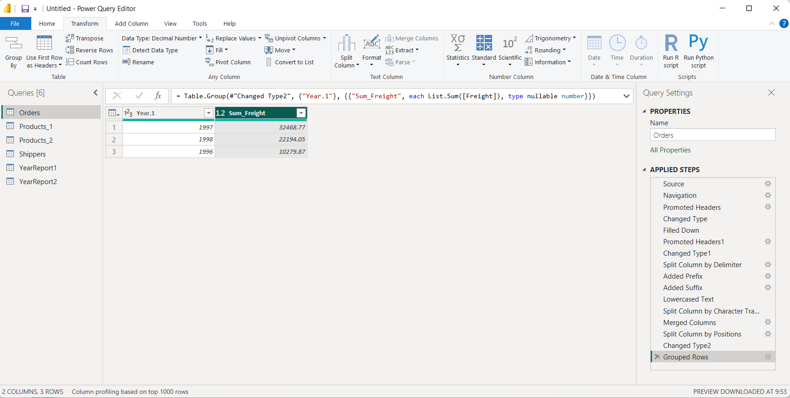  

 

## 7. Pivot & Unpivot Columns

> **PIVOT** : เปลี่ยนข้อมูล แนวตั้ง Column > แนวนอน Row          (field เพิ่ม , record ลดลง)  
> **Unpivot** : เปลี่ยนข้อมูล แนวนอน Row > แนวตั้ง Column        (field ลด  , record เพิ่มขึ้น)

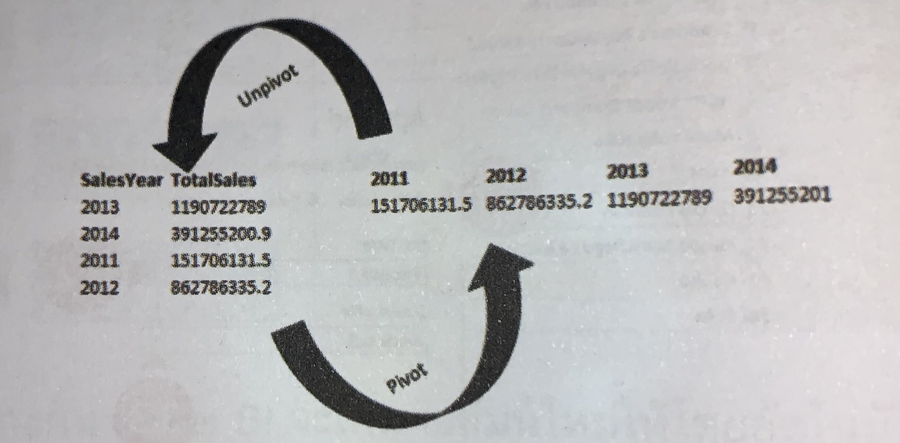  

 7.1 Pivot column 

- เลือกคอลัมน์ **Year**
- แท็บ **Transform > Pivot Column**
- ที่ไดอะล็อก Pivot Column ให้กำหนดค่าดังนี้
    - **Value Column : Freight** ใช้ข้อมูลในคอลัมน์ “ Year “ สร้างคอลัมน์ใหม่ขึ้นมาแล้วดึงค่า จากคอลัมน์ Freight ที่สัมพันธ์มาใส่ > **OK**  

    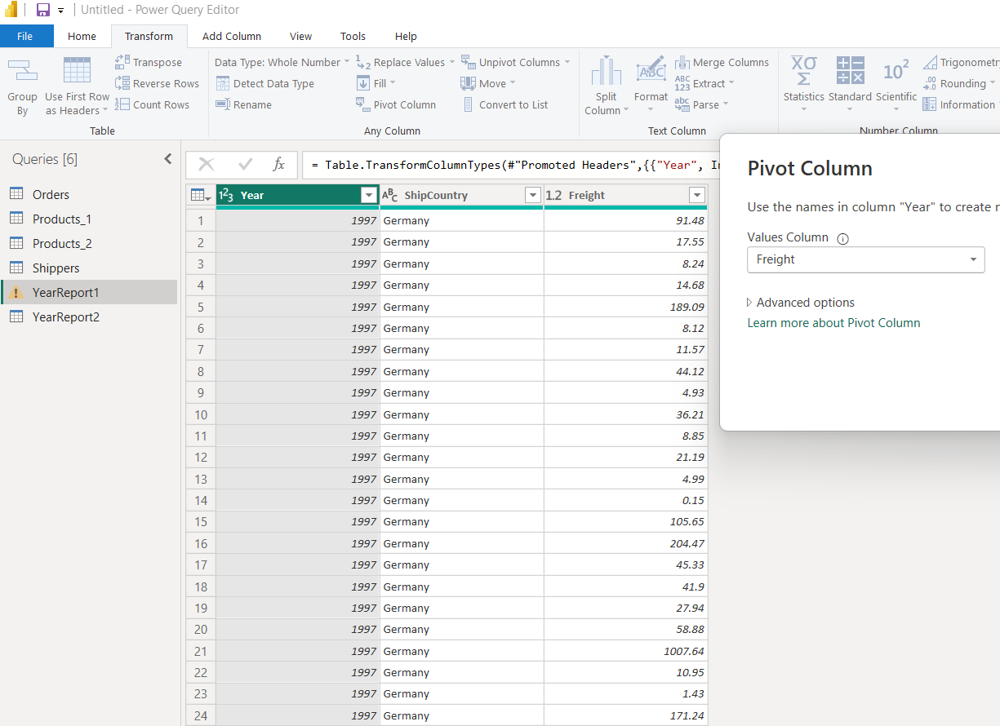  

- **ผลลัพธ์**  
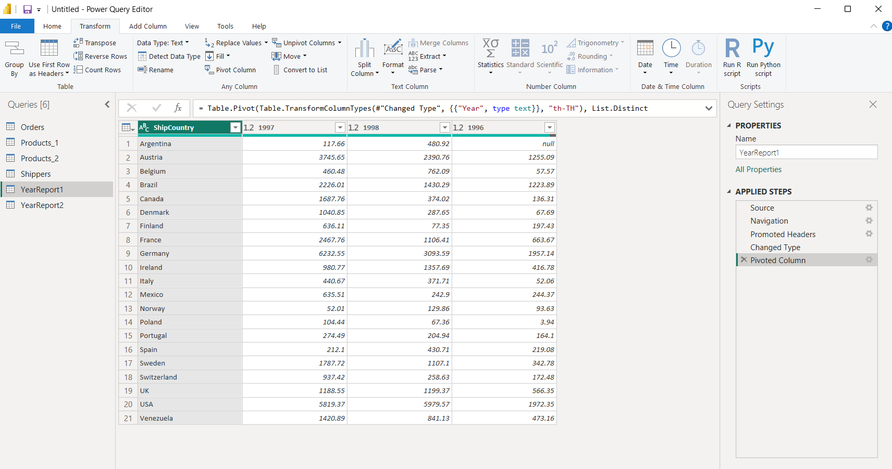  
คอลัมน์ที่ Pivot คือ Freight ⇒ ส่วนปีจะเป็น Columns ไป

 7.2 Unpivot column 

- คลิกเลือก 3 คอลัมน์ คือ 1996, 1997, 1998
- แท็บ Transform > Unpivot Column  
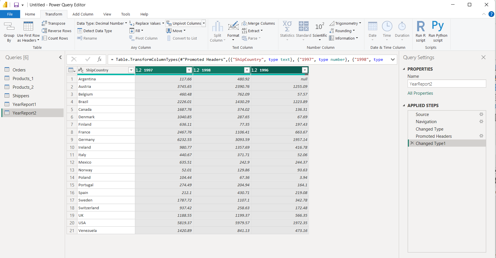  
- **ผลลัพธ์**  
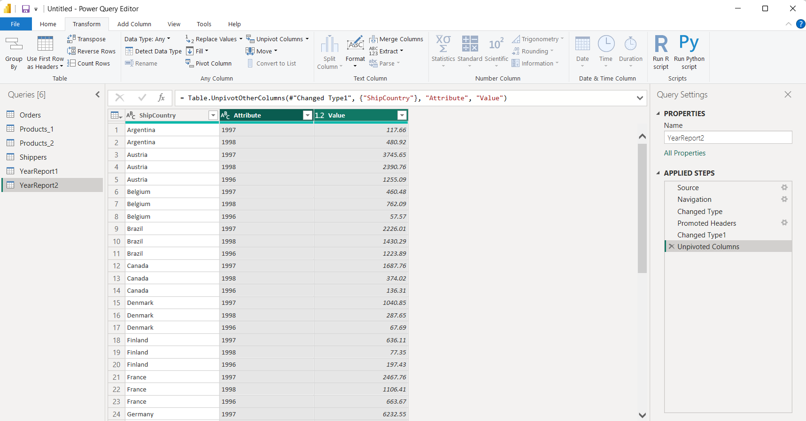  
    - จะเห็นว่าข้อมูลแนวนอน (Row) 1996, 1997, 1998 เปลี่ยนมาเป็นแนวตั้ง (Column) ในตัวอย่างนี้ก็คือ คอลัมน์ Value โดยแต่ละประเทศจะมี 3 บรรทัด 3 ปี และ 3 ค่า  
    - Unpivot จะได้ Record ที่มากขึ้น

